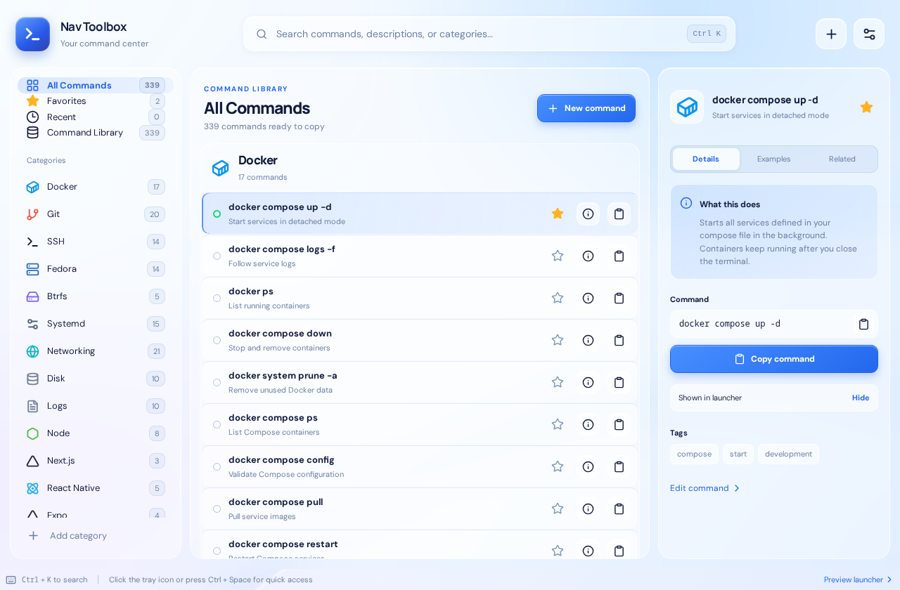
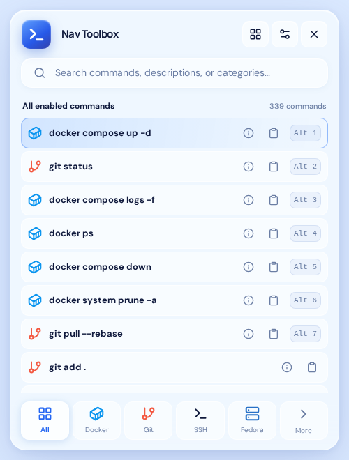
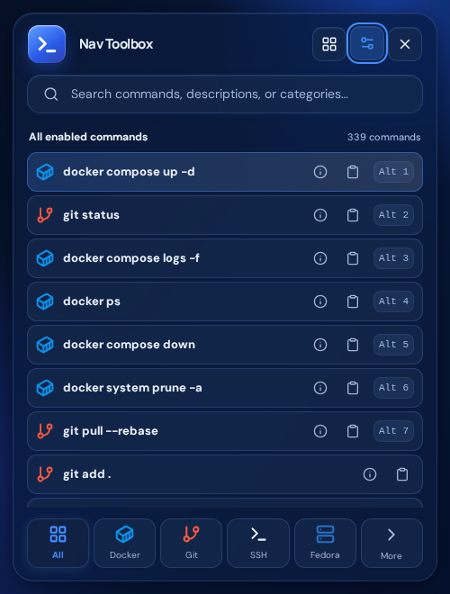

# Nav Toolbox

Nav Toolbox is a Linux desktop command library with a compact launcher and a full manager. It uses pale blue glass in light mode and navy glass in dark mode.



These browser previews show the 0.1.1 layout with the full catalog enabled for demonstration. The native app stores your enabled commands in SQLite.

<details>
<summary>Compact launcher in light and dark mode</summary>




</details>

## Features

- Tauri v2 desktop windows, a Linux StatusNotifier tray, and configurable global shortcut (default `Ctrl+Space`)
- Scroll every enabled command in the launcher; More filters categories without opening the manager
- Visible launcher close button, details on demand, and an edge-to-edge manager workspace
- Single-instance desktop startup: opening the app again brings forward the existing manager
- SQLite storage, fuzzy search, favorites, recent commands, categories, and JSON backup
- 339 bundled commands across 35 categories, with individual and category visibility controls
- Clipboard copy as the primary action; optional terminal Run, disabled by default
- Light, dark, and system themes; optional autostart and close after copy
- Full manager with category sidebar, command list, details, editing, and settings
- Keyboard: `Ctrl+K` focuses search, arrows select, `Enter` copies, `Alt+I` opens details while searching (`I` works outside text inputs), `Alt+1`–`Alt+7` copy launcher rows, and `Esc` closes overlays

The first 24 commands are enabled by default, and all of them can be scrolled in the launcher. The other 315 start hidden. Open **Command Library** in the manager to enable individual commands or whole categories for your system. Commands containing `<placeholder>` must be edited before Run.

The desktop app works locally without an account or Nav Toolbox server. Fonts are bundled. The browser preview stores data in browser local storage; the desktop app uses SQLite.

## Install status and Linux compatibility

Cloning this repository or running the browser preview does **not** install Nav Toolbox. Version 0.1.1 has been built as a Fedora 44 RPM. After building locally, install it with:

```bash
sudo dnf install './src-tauri/target/release/bundle/rpm/Nav Toolbox-0.1.1-1.x86_64.rpm'
```

A package built on Fedora 44 uses that system's library baseline; use the Ubuntu 22.04 Linux-packages workflow for packages intended for older distributions. The older 0.1.0 artifact link below does not contain the launcher fixes.

The native RPM, Deb, and AppImage builds with all 339 commands succeeded on Ubuntu 22.04 in [GitHub Actions](https://github.com/borderlogcanada/nav-toolbox/actions/runs/36616858018). Download the `nav-toolbox-linux-packages` artifact from that run and extract it (GitHub sign-in required). These initial x86_64 packages still need interactive testing on the target desktop; a successful build does not verify tray, shortcut, or terminal behavior.

From the extracted artifact directory, choose the command for your system:

```bash
sudo dnf install './rpm/Nav Toolbox-0.1.0-1.x86_64.rpm'
sudo apt install './deb/Nav Toolbox_0.1.0_amd64.deb'
chmod +x './appimage/Nav Toolbox_0.1.0_amd64.AppImage'
'./appimage/Nav Toolbox_0.1.0_amd64.AppImage'
```

The AppImage is intended for other desktop Linux distributions. Build it on an older supported Linux baseline to improve glibc compatibility, as described in [Tauri's AppImage guide](https://v2.tauri.app/distribute/appimage/). Tray display and shortcut registration can vary by desktop environment.

## Fedora development setup

Install Node.js 22.12+ (a supported LTS release), Rust, and the [Tauri Linux prerequisites](https://v2.tauri.app/start/prerequisites/):

```bash
sudo dnf install rust cargo webkit2gtk4.1-devel openssl-devel curl wget file libappindicator-gtk3-devel librsvg2-devel patchelf rpm-build
sudo dnf group install "c-development"
```

Alternatively, manage Rust with [rustup](https://rustup.rs/). Then:

```bash
cd nav-toolbox
npm ci
npm run desktop:dev
```

For a browser-only UI preview, Rust and WebKitGTK are unnecessary:

```bash
npm ci
npm run dev
```

Open `http://127.0.0.1:1420/` for the manager or `http://127.0.0.1:1420/?view=popup` for the launcher on the PC.

For a phone connected to the **same Tailscale network** as the PC, start Vite on the PC's Tailscale IPv4 address (shown by `tailscale ip -4`):

```bash
npm run dev -- --host "$(tailscale ip -4)"
```

Then open `http://PC_TAILSCALE_IP:1420/` in the phone browser. Keep that terminal running. A Vite server that says `Local: http://127.0.0.1:1420/` is reachable only from the PC; the phone's `127.0.0.1` is a different device. On mobile data, the PC's `10.x.x.x` home-network address usually is not reachable.

Alternatively, with an SSH client that supports **local port forwarding**, keep Vite running on `127.0.0.1` on the PC and set up a local forward from the phone:

```bash
ssh -N -L 1420:127.0.0.1:1420 user@your-pc
```

Open `http://127.0.0.1:1420/` in the phone's browser while that SSH session stays connected. Run the forwarding command **on the phone**, not inside the remote Fedora shell; a phone SSH app may expose the same setting as **Local port forwarding**. The browser preview cannot test the tray, global shortcut, SQLite, or native Run action.

## Build and verify

```bash
npm run check:catalog
npm run check:migrations
npm run test:launcher
npx playwright install chromium
npm run test:ui
npm run format:check
npm run build
npm run desktop:build
```

Build one package format with `npm run tauri build -- --bundles rpm`, `--bundles deb`, or `--bundles appimage`. After pushing the repository, the manual **Linux packages** GitHub Actions workflow can build downloadable RPM, Deb, and AppImage artifacts on Ubuntu 22.04. Review and test those packages before attaching them to a public release.

The Linux build enables the KSNI StatusNotifier backend. Left activation toggles the launcher; right-click offers **Open Launcher**, **Open Manager**, **Settings**, and **Quit**. GNOME needs a StatusNotifier/AppIndicator tray extension to display the icon. Other desktops and tray hosts may handle clicks differently; the global shortcut remains available.

On Wayland, the app prefers XWayland when it is available so it can position the launcher below the activation point. An explicit `GDK_BACKEND` environment setting is respected; native Wayland may let the compositor choose the window position. When the tray host provides no position, the launcher uses the screen's top-right corner. Popup size and position are constrained to the monitor's available work area. If `Ctrl+Space` is reserved by your desktop or input method, change the shortcut in Settings.

## Run and data safety

Run is off initially. Each Run asks for confirmation. Commands matching `sudo`, `rm`, `dd`, `mkfs`, `chmod`, `chown`, and related utilities receive an extra warning. The Rust backend resolves a saved, enabled command by ID and rejects template placeholders. Run starts a visible terminal with the user's privileges. Supported terminals are GNOME Terminal, Console (`kgx`), Konsole, Xfce Terminal, and `x-terminal-emulator`.

Import checks backup structure and limits JSON to 5 MB, then replaces the current catalog and settings after confirmation. Run and autostart stay off after import until explicitly enabled again. Backups can contain hostnames, paths, and secrets entered by the user, so keep them private. SQLite lives under Tauri's per-app data directory as `nav-toolbox.db`.

## Project layout

```text
src/App.tsx                  manager and launcher UI
src/styles.css               light and dark themes
src/lib/data.ts              native and browser data adapter
src/lib/native.ts            clipboard, shortcuts, autostart, dialogs
src/lib/launcher.ts          enabled results, search and ordering
src/data/seed.json           initial visible commands
src/data/catalog-v2.json     optional developer command packs
src/data/catalog-v3.json     everyday Linux basics
src-tauri/src/db.rs          SQLite schema and persistence
src-tauri/src/lib.rs         native commands and app lifecycle
src-tauri/src/tray.rs        tray activation and bounded popup placement
src-tauri/icons/             app icon assets
```

## Verification status

For 0.1.1, local checks passed: four launcher data tests, four browser interaction tests (including light/dark themes and 900×620/1280×840 manager layouts), three Rust placement tests, catalog and migration checks, formatting, production frontend build, and the Fedora RPM build. `npm audit` reported zero known vulnerabilities at verification time.

The installed Fedora tray was tested through its native StatusNotifier API: it registered as an activation-capable item, opened a 500×660 launcher at the top of the screen, closed on a second activation, and used the top-right fallback when no coordinates were supplied. A second native launch reused the existing process and reopened the 1280×840 manager. The user also reported that the updated app was working. Screenshots in [`docs/screenshots/`](docs/screenshots/) are browser previews, not proof of native desktop compatibility. Physical shortcut behavior and other desktop environments still need their own interactive checks.

Nav Toolbox uses the [MIT license](LICENSE). See [CONTRIBUTING.md](CONTRIBUTING.md) and [SECURITY.md](SECURITY.md).

## Everyday Linux coverage

The Linux basics pack adds 176 commands: files and navigation, reading and processing text, searching, archives, permissions, users and groups, system information, editors and help, shell variables and jobs, plus more networking, SSH, service, and package commands. See [catalog coverage and sources](docs/CATALOG.md). Commands tagged `current-shell`, such as `cd`, `export`, and `alias`, are copy-only so they affect the terminal where you paste them.
