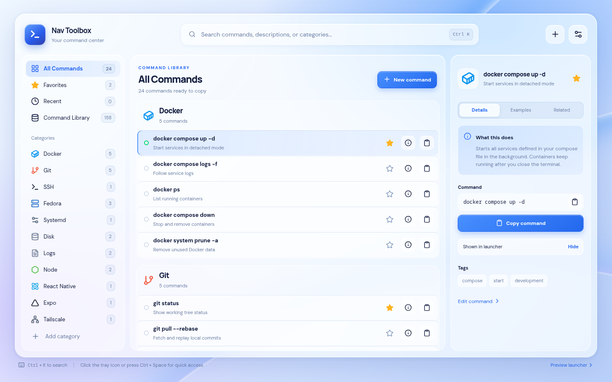
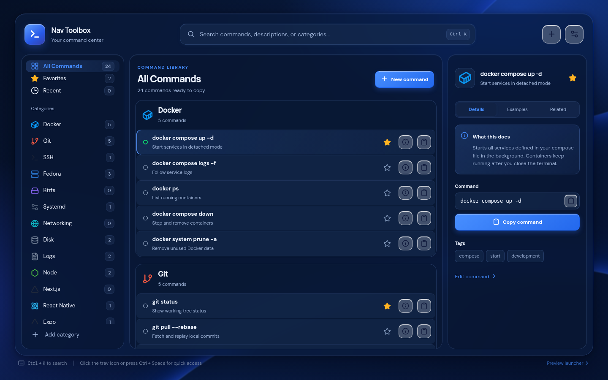
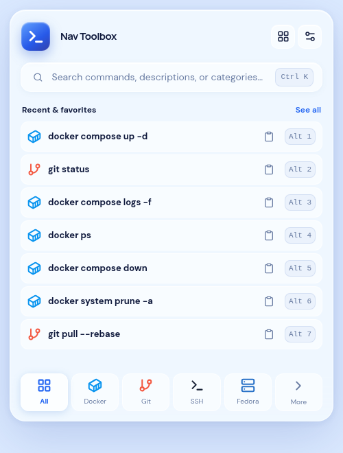
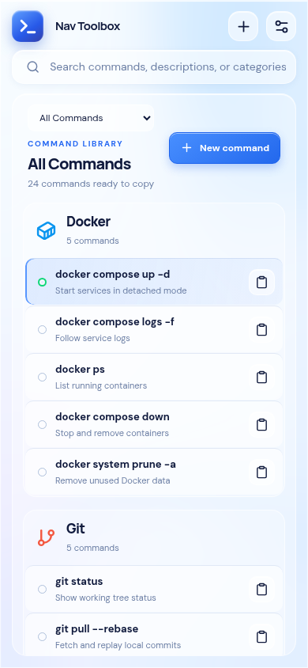

# Nav Toolbox

Nav Toolbox is a Linux desktop command library with a compact launcher and a full manager. It uses pale blue glass in light mode and navy glass in dark mode.



<details>
<summary>Dark theme, compact launcher, and phone preview</summary>





</details>

## Features

- Tauri v2 desktop windows, tray menu, and configurable global shortcut (default `Ctrl+Space`)
- SQLite storage, fuzzy search, favorites, recent commands, categories, and JSON backup
- 163 bundled commands across 26 categories, with individual and category visibility controls
- Clipboard copy as the primary action; optional terminal Run, disabled by default
- Light, dark, and system themes; optional autostart and close after copy
- Full manager with category sidebar, command list, details, editing, and settings
- Keyboard: `Ctrl+K` focuses search, arrows select, `Enter` copies, `I` opens details, `Alt+1`–`Alt+7` copy launcher rows, and `Esc` closes overlays

The first 24 commands appear by default. The other 139 start hidden. Open **Command Library** in the manager to enable individual commands or whole categories for your system. Commands containing `<placeholder>` must be edited before Run.

The desktop app works locally without an account or Nav Toolbox server. Fonts are bundled. The browser preview stores data in browser local storage; the desktop app uses SQLite.

## Install status and Linux compatibility

Cloning this repository or running the browser preview does **not** install Nav Toolbox. The first native RPM, Deb, and AppImage builds succeeded on Ubuntu 22.04 in [GitHub Actions](https://github.com/borderlogcanada/nav-toolbox/actions/runs/36602501921). Download the `nav-toolbox-linux-packages` artifact from that run and extract it (GitHub sign-in required). These initial x86_64 packages still need interactive testing on the target desktop; a successful build does not verify tray, shortcut, or terminal behavior.

From the extracted artifact directory, choose the command for your system:

```bash
sudo dnf install './rpm/Nav Toolbox-0.1.0-1.x86_64.rpm'
sudo apt install './deb/Nav Toolbox_0.1.0_amd64.deb'
chmod +x './appimage/Nav Toolbox_0.1.0_amd64.AppImage'
'./appimage/Nav Toolbox_0.1.0_amd64.AppImage'
```

The AppImage is intended for other desktop Linux distributions. Build it on an older supported Linux baseline to improve glibc compatibility, as described in [Tauri's AppImage guide](https://v2.tauri.app/distribute/appimage/). Tray display and shortcut registration can vary by desktop environment.

## Fedora development setup

Install Node.js 20.19+ or 22.12+, Rust, and the [Tauri Linux prerequisites](https://v2.tauri.app/start/prerequisites/):

```bash
sudo dnf install webkit2gtk4.1-devel openssl-devel curl wget file libappindicator-gtk3-devel librsvg2-devel libxdo-devel
sudo dnf group install "c-development"
```

Install Rust with [rustup](https://rustup.rs/) and restart your shell. Then:

```bash
cd nav-toolbox
npm ci
npm run desktop:dev
```

For a browser-only UI preview, Rust and WebKitGTK are unnecessary:

```bash
npm ci
npm run dev
```

Open `http://127.0.0.1:1420/` for the manager or `http://127.0.0.1:1420/?view=popup` for the launcher on the PC.

For a phone connected to the **same Tailscale network** as the PC, start Vite on the PC's Tailscale IPv4 address (shown by `tailscale ip -4`):

```bash
npm run dev -- --host "$(tailscale ip -4)"
```

Then open `http://PC_TAILSCALE_IP:1420/` in the phone browser. Keep that terminal running. A Vite server that says `Local: http://127.0.0.1:1420/` is reachable only from the PC; the phone's `127.0.0.1` is a different device. On mobile data, the PC's `10.x.x.x` home-network address usually is not reachable.

Alternatively, with an SSH client that supports **local port forwarding**, keep Vite running on `127.0.0.1` on the PC and set up a local forward from the phone:

```bash
ssh -N -L 1420:127.0.0.1:1420 user@your-pc
```

Open `http://127.0.0.1:1420/` in the phone's browser while that SSH session stays connected. Run the forwarding command **on the phone**, not inside the remote Fedora shell; a phone SSH app may expose the same setting as **Local port forwarding**. The browser preview cannot test the tray, global shortcut, SQLite, or native Run action.

## Build and verify

```bash
npm run check:catalog
npm run format:check
npm run build
npm run desktop:build
```

Build one package format with `npm run tauri build -- --bundles rpm`, `--bundles deb`, or `--bundles appimage`. After pushing the repository, the manual **Linux packages** GitHub Actions workflow can build downloadable RPM, Deb, and AppImage artifacts on Ubuntu 22.04. Review and test those packages before attaching them to a public release.

The tray menu offers **Open Launcher**, **Open Manager**, **Settings**, and **Quit**. Linux tray click behavior depends on the desktop environment; the menu and global shortcut are the reliable entry points. The popup opens near the screen top. If `Ctrl+Space` is reserved by your desktop or input method, change the shortcut in Settings.

## Run and data safety

Run is off initially. Each Run asks for confirmation. Commands matching `sudo`, `rm`, `dd`, `mkfs`, `chmod`, `chown`, and related utilities receive an extra warning. The Rust backend resolves a saved, enabled command by ID and rejects template placeholders. Run starts a visible terminal with the user's privileges. Supported terminals are GNOME Terminal, Console (`kgx`), Konsole, Xfce Terminal, and `x-terminal-emulator`.

Import checks backup structure and limits JSON to 5 MB, then replaces the current catalog and settings after confirmation. Run and autostart stay off after import until explicitly enabled again. Backups can contain hostnames, paths, and secrets entered by the user, so keep them private. SQLite lives under Tauri's per-app data directory as `nav-toolbox.db`.

## Project layout

```text
src/App.tsx                  manager and launcher UI
src/styles.css               light and dark themes
src/lib/data.ts              native and browser data adapter
src/lib/native.ts            clipboard, shortcuts, autostart, dialogs
src/data/seed.json           initial visible commands
src/data/catalog-v2.json     optional command packs
src-tauri/src/db.rs          SQLite schema and persistence
src-tauri/src/lib.rs         tray, windows, native actions
src-tauri/icons/             app icon assets
```

## Verification status

The frontend build, formatting, catalog validation, dependency audit, and Rust compile check passed in [CI](https://github.com/borderlogcanada/nav-toolbox/actions/runs/36602453502). The [Linux package build](https://github.com/borderlogcanada/nav-toolbox/actions/runs/36602501921) also succeeded and generated RPM, Deb, and AppImage packages. Interactive native testing on Fedora and other desktops remains outstanding. Screenshots in [`docs/screenshots/`](docs/screenshots/) show the browser preview.

Nav Toolbox uses the [MIT license](LICENSE). See [CONTRIBUTING.md](CONTRIBUTING.md) and [SECURITY.md](SECURITY.md).
